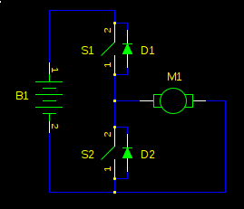
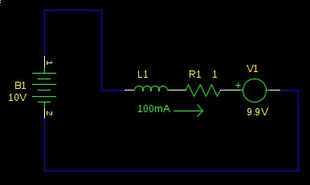
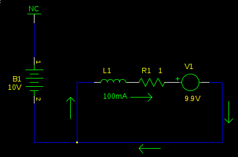
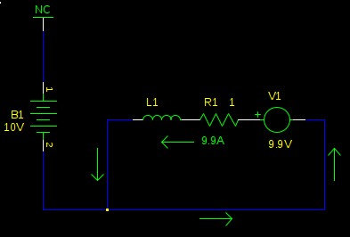
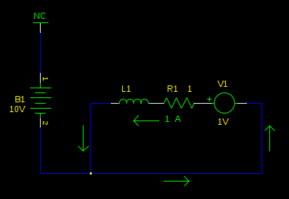
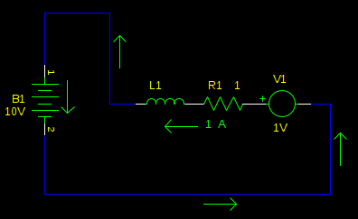
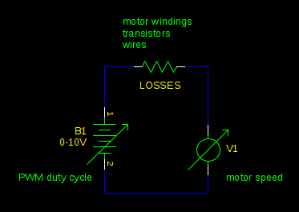

# Project MuscleEngine01

## Introduction
**M**echanical energe **U**pcycling hardware with **S**uper **C**apacitor for **LE**gged robots / **ENGINE** no.**01**

머슬엔진은 보행 과정에서 버려지는 역학적 에너지를 사용하여 슈퍼 커패시터를 충전하고, 필요할 때 운동 에너지로 전환시키는 로우레벨 하드웨어입니다.

# TTAGGG - 240918 - MuscleEngine01

# 1. Understanding Regenerative Braking

---

회생제동 기술을 이해해보자.

[How can I implement regenerative braking of a DC motor?](https://electronics.stackexchange.com/questions/56186/how-can-i-implement-regenerative-braking-of-a-dc-motor/56187#56187)

모터를 한 방향으로만 회전한다고 가정하고 하프브릿지 회로를 생각해보자.

(참고 : 이 글에서 말하는 하프브릿지 회로는 H브릿지의 절반을 잘라놓은 구조로, 모터에 한 쪽 방향의 전류만을 걸 수 있는 드라이버 회로를 말한다.)

첫번째로, 비회생제동에 대해 생각해보자. 브릿지 출력이 high면(S1 닫고 S2 열기) 모터를 최대로 가속시킬 수 있다. 하지만 브릿지 출력이 low면(S1 열고 S2 닫기) 모터가 부드럽게 멈추는 것이 아니라 마치 누군가가 브레이크를 건 것처럼 세게 멈춰버릴 것이다. 왜 그런지 알아보자.

DC모터는 인덕터와 전압원(V1)이 직렬 연결된 형태로 생각할 수 있다.

모터의 토크는 전류에 비례한다. 전압원(V1)은 역기전력이라고 불린다.

그리고 역기전력(역기전력의 단위는 볼트다. 와트가 아니다.)은 모터의 속도와 비례한다(BEMF = B*l*v)

이것이 모터에 부하가 걸렸을 때(또는 걸렸을 때) 더 많은 전류를 사용하는 이유다.

속도가 감소함에 따라 역기전력도 감소한다. 따라서 공급 전압(B1)에 덜 저항하므로 더 큰 전류가 흐르는 것으로 이어진다.(I=V/R, 역기전력이 작아져서 V가 커짐)

이 그림에서 값들은 모터가 빠른 속도로 회전하고 있을 때의 값들이다.

이 모터는 최고 속도로 회전하고 있다. (모터의 역기전력이 거의 최대이므로 공급 전압과 많이 상쇄되었지만) 모터의 기계적 저항을 넘을 정도의 작은 전류(100mA)만 흐르고 있다. 역기전력이 공급전압과 거의 같아 R1을 지나며 발생하는 전압 강하를 줄이고 있다. 따라서 전류가 별로 흐르지 않는다.

(옴의 법칙의 거시적 정의 I=V/R에 의해 R1에서의 전압 강하가 작을 수록 작은 전류가 흐른다.)

따라서 L1과 R1에는 100mV(10V - 9.9V = 0.1V)밖에 걸리지 않는다.

위 사진은 하프브릿지가 High side에 연결 되어있을 때의 경우다. 이제 Low side에 연결하면 어떤 일이 일어나는지 알아보자.

Low side에 연결된 직후, 처음에는 아무 일도 없다. 인덕터 L1이 전류의 변화를 억제하기 때문이다. 하지만 이것은 오래 가지 않는다.

(이 지속시간을 나타내는 Time constant는 $L_1/R_1$으로 정의되며 일반적으로는 몇 밀리초를 넘기지 못한다.)

조금 있으면 역기전력에 의해 전류가 반전된다. 그리고 이 전류는 꽤 크다.

$L_1$과 $R_1$의 경우 방금 전까지는(인덕터에 의해) $V_{B1}$과 $V_1$가 상쇄된 전압($100mV$)앞에 놓여있었지만 지금 이들은 인덕터에 의해 남아있던 $V_{B1}$이 사라졌으므로 $V_1$에서 나오는 $9.9V$ 앞에만 놓여있다. 따라서 전압원 $V_1$에 대해 역방향으로 흐르는 큰 전류를 볼 수 있다.

그리고 앞서 이야기했듯 토크는 전류에 비례한다.이로 인해 마찰력 정도는 뛰어넘는, 강한 역방향 토크가 걸린다.

이 역방향 토크로 인해 모터는 감속하고, 역기전력은 모터의 속도에 비례하므로 역기전력 또한 줄어든다. 역기전력이 작아지면 역방향 전류도 작아져 역방향 토크도 작아진다. 이것은 모터가 완전히 정지할 때까지 반복된다.

역학적 에너지가 어디로 갔는지 알아보도록 하자.

위 회로를 다시 보면 9.9A가 R1(모터의 코일)을 지나고 있다. 따라서 모터의 코일에서는 $P_{R1} = VI = I^2R = 98.01(W)$가 역학적 에너지에서 열 에너지로 전환되고 있다.(실제 회로에서는 브릿지 회로의 트랜지스터나 모스펫의 전기저항 등도 해당한다.) 일부 모터는 아닐 수도 있지만 일부 모터는 이 큰 일률에 의해 파괴될 수 있다.

이 역기전력에 의한 전류는 스탈 전류(모터가 외력에 의해 움직이지 못할 때 소비하는 전류)와 크기가 같다. 따라서 사용하고자하는 모터가 걸린 상태에서 과열되지 않고 동작할 수 있다면 이 비회생제동 방식의 브레이크 기능을 하루종일 사용할 수 있다.

이 열에너지로 전환되는 에너지를 저장할 수는 없을까.

방금 전 알아본 브레이킹을 시작하고 약간의 시간이 지났지만 모터가 정지하기 전 어떤 상태인지 보자.

모터의 감속이 진행된 상태이므로 역기전력은(모터의 각속도에 비례하므로) $1V$까지 내려간 상태다. 역기전력이 감소했으므로 전류 또한 감소한 상태다.

만약 이 상태에서 브릿지를 High side에 연결하면 어떤 일이 일어날까.

배터리가 충전된다. 물론 이 상태가 지속되면 인덕터의 효과가 약해지다 결국 전압원 B1에 의해 전류가 정방향으로 흐르게 될 것이다.(이 역방향 전류의 지속시간 역시 $L_1/R_1$로 정의된다.)

따라서 이 지속시간이 끝나고 나면 정방향 전류에 의해 배터리가 방전되기 시작하고 모터가 감속이 아닌 가속되기 시작한다. (그러지 말자…)

이 상태를 유지할수록 전류는 감소한다. 이 때 브릿지의 Low side로 다시 연결하면 역기전력은 여전히 존재하므로 이것을 이용해 인덕터에 흐르는 전류를 다잡고 다시 잠시 high side에 연결하는 것을 반복하면 인덕터 효과에 의해 다시 잠시 전원 B1에 역방향 전류를 걸 수 있다.

눈치 챘을 수 있지만, 사실 High side와 Low side를 왕복하는 이 작업은 모터드라이버의 PWM이 하는 일과 같다.

작동 방식의 원리를 이해했다면, 추상화할 수 있다. 모터가 PWM에 의해 구동될 때, 모터의 인덕턴스 L1은 플라이휠(관성바퀴, 오르골이나 증기기관 등에서 각속도를 일정하게 만들기 위해 장착한 회전 관성을 갖는 바퀴)처럼 동작하며 PWM에 의해 오르내리는 전압의 평균을 내준다.

실제 플라이휠을 망치로 반복적으로 때려서 회전하도록 만드는 것과 비슷하다.

따라서 공급 전압이 $10V$고 PWM 듀티사이클이 80%라면, 사실상 모터를 평균 공급 전압인 $8V$로 구동 중인 셈이다.

역기전력이 이 전압(8V)보다 크다면, 회생제동이 된다. 이러한 일은 외력(마찰력 등)이 모터를 감속시키는 속도보다 PWM 듀티사이클이 더 빠르게 감소할 때 나타난다.

(해설 : 모터가 최고 속도에 도달한 상황을 생각해보면 기계적 저항이 없어도 역기전력이 공급 전압보다 커질 수는 없다. 앞서 알아보았듯, 공급 전압과 역기전력이 서로 상쇄되고 난 후의 전류가 기계적 저항을 이겨내는 토크를 발생시키므로, 일반적으로 역기전력은 공급 전압보다 작다.
모터가 마찰력과 같은 외력에 의해 각속도는 감소하고, 각속도에 비례하는 역기전력또한 자연스럽게 작아지는데, 만약 평균 공급 전압이 감소하는 속도가 기계적 저항에 의해 역기전력이 감소하는 속도보다 빠르다면, 짧은 시간 동안은 역기전력이 평균 공급 전압보다 더 클 수 있다.
이 경우 전류는 전압이 높은 곳에서 낮은 곳으로 흐르므로 역방향 전류가 발생하여 배터리가 충전된다.)

회로의 모든 저항은 회수 가능한 역학적 에너지에 대한 손실을 유발한다. 가장 극단적인 경우를 생각하면, PWM 듀티사이클이 0%로 내려가서 모터의 두 터미널(양쪽 전극)이 서로 합선된 채로 있어야하는 경우, 에너지 손실은 100%에 달한다. (참고 : 듀티사이클이 0%면 애초에 배터리 쪽에 연결된 적이 없고 모터의 내부저항을 통해 모든 역학적 에너지가 열 에너지로 버려진다.)

(가장 처음 봤던 이 회로를 다시 보도록 하자.)

이 브릿지의 모든 트랜지스터를 열 수도 있다.(S1 열림, S2 열림) 이 경우 인덕터의 전류는 다이오드에 의해 소멸한다. 그리고 역기전력과 전압원 B1 모두 전류를 발생시킬 길이 없다.
